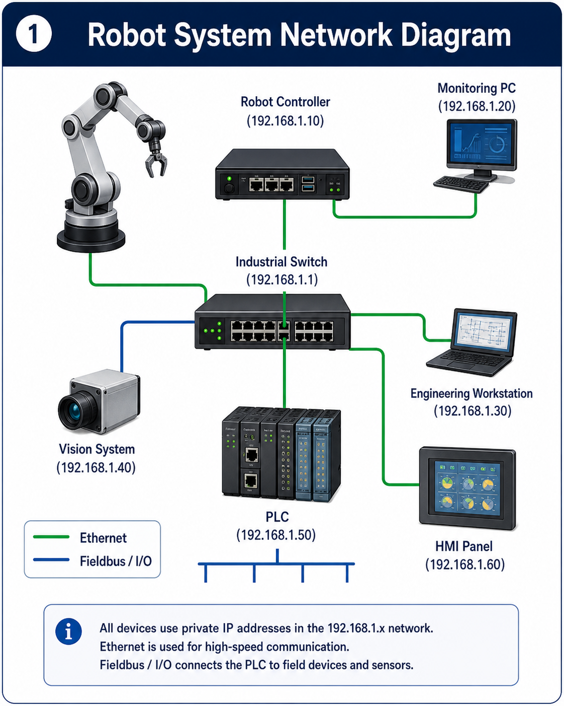
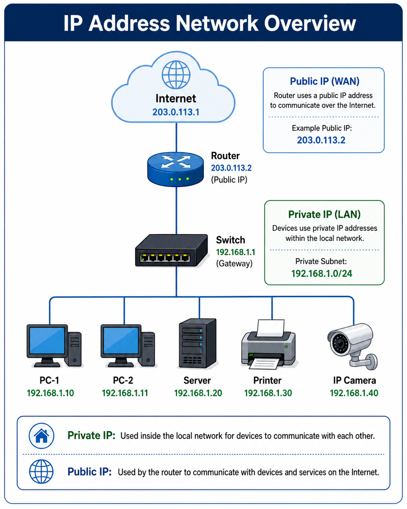
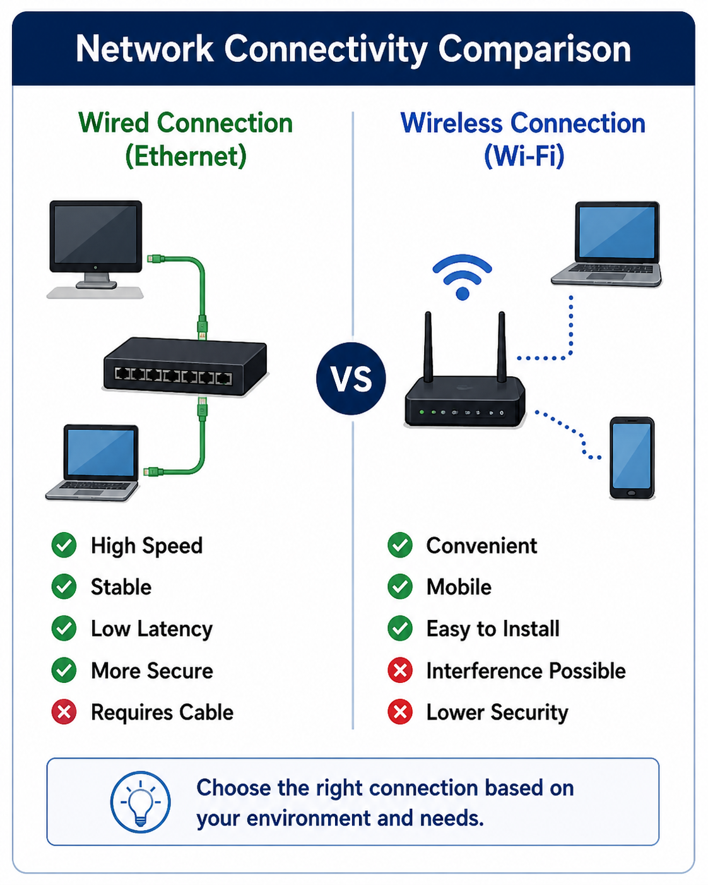
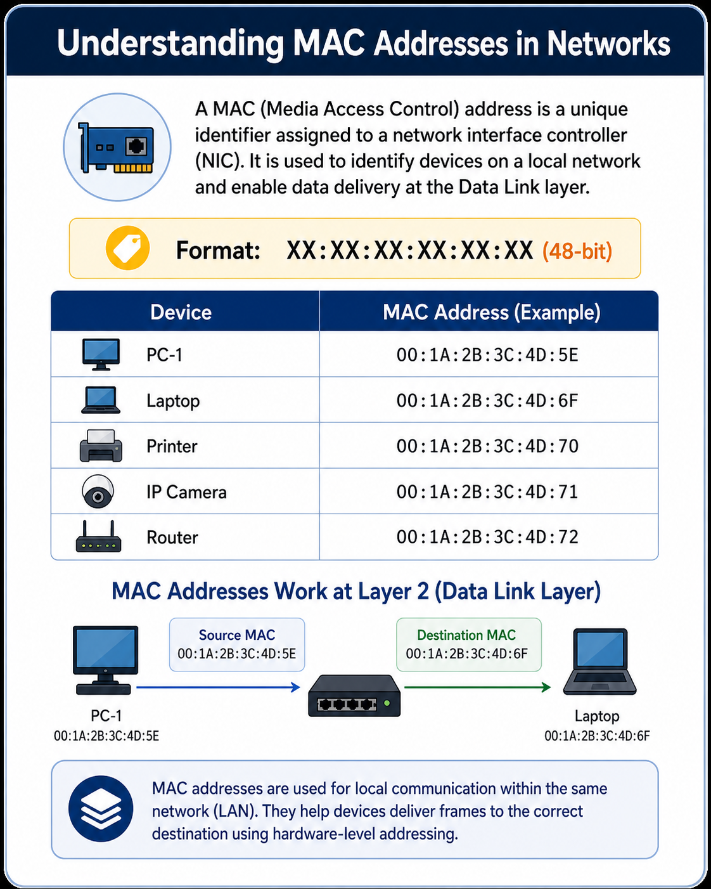
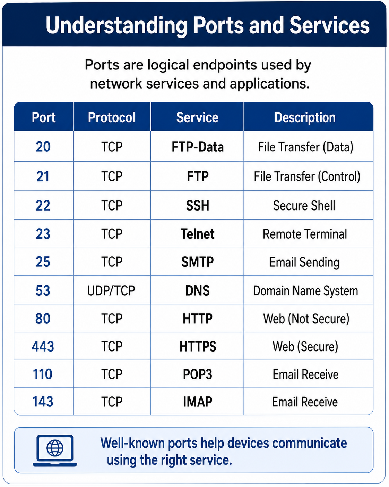
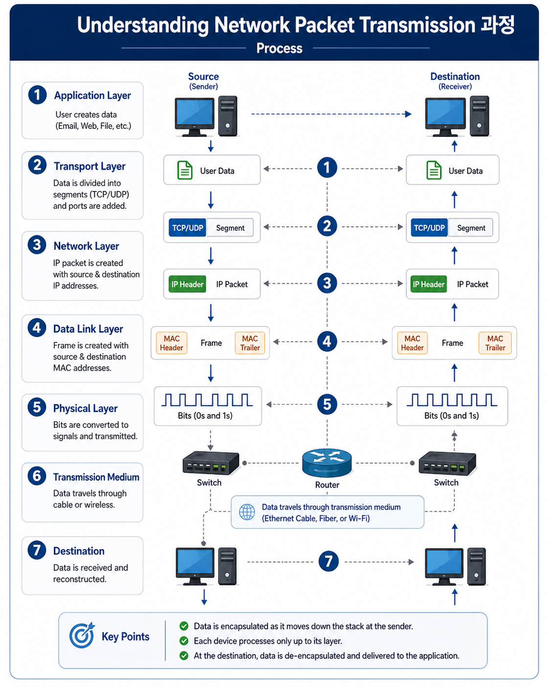
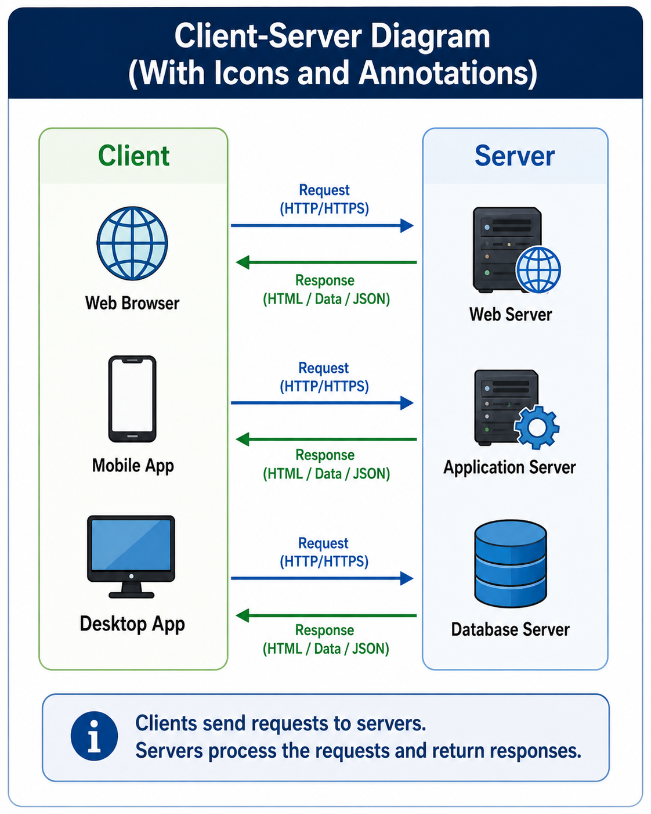
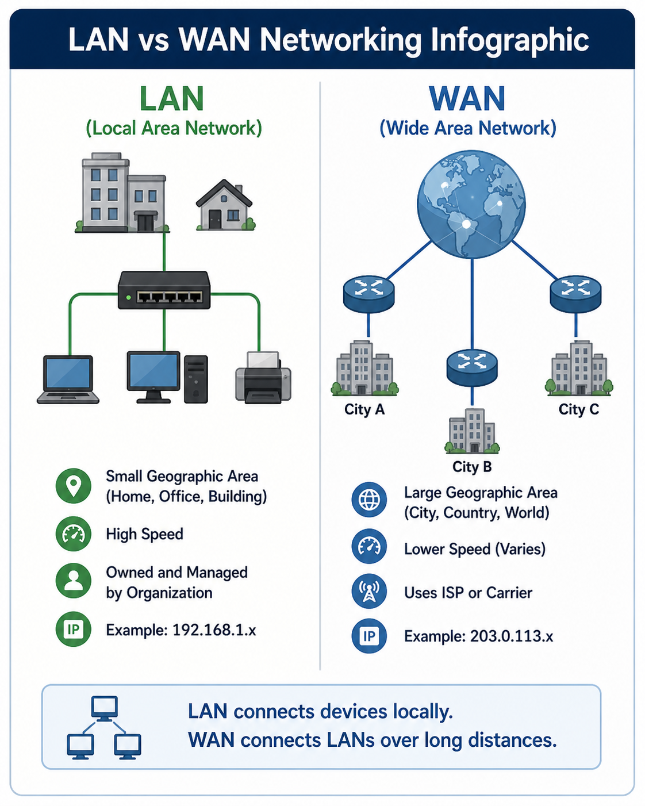
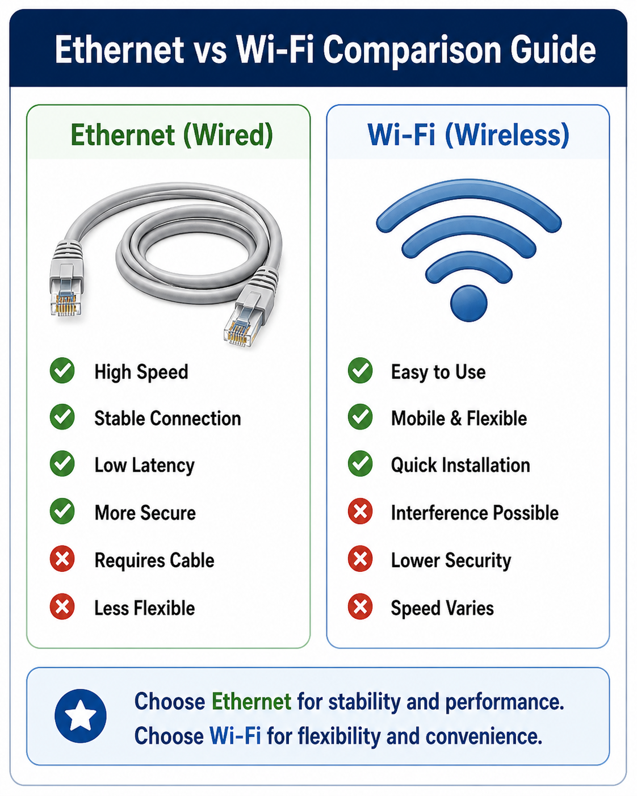
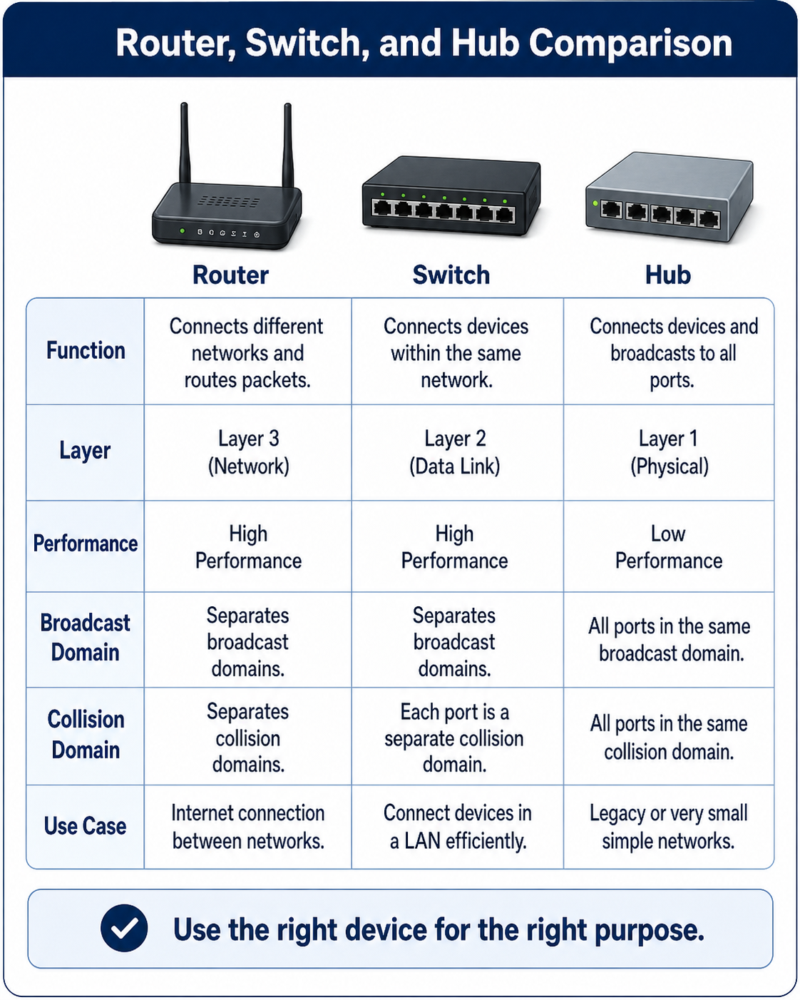

# Chapter 1. 네트워크 기초 개념 이해

> **목적**
> 로봇 개발자가 PC·로봇·센서·공유기·스위치가 **어떤 계층에서 어떻게 연결되는지** 설명할 수 있게 한다. 이 문서는 TCP/IP를 한 번에 깊게 파고들기보다, 현장에서 막히는 지점(주소, 포트, 망 분리, 장비 역할)을 **진단 가능한 언어**로 정리하는 데 초점을 둔다.

---

## 1. 학습 목표

로봇 스택에서 SSH, 웹 UI, ROS 2, 센서 스트림, 원격 모니터링은 모두 **패킷이 목적지까지 도달하고, 올바른 프로세스(포트)에 전달**될 때만 동작한다. 이 챕터를 마치면 아래를 **동료에게 짧게 설명**할 수 있어야 한다.

| 영역 | 다루는 내용 |
|---|---|
| 주소 | IPv4 주소, MAC 주소의 역할 차이, “같은 네트워크”의 실무적 의미 |
| 엔드포인트 | 포트(프로세스 구분), 클라이언트·서버 관점 |
| 전달 단위 | 패킷, 손실·지연을 이야기할 때의 기본 단위 |
| 망의 범위 | LAN / WAN, Ethernet / Wi-Fi 선택 기준 |
| 장비 | 라우터·스위치·허브의 역할 구분 |

부록 수준으로만 짚자면: 여기서 말하는 “네트워크”는 대부분 **이더넷 위의 IPv4**를 전제로 한다. IPv6·브리지·VLAN은 이후 챕터나 운영 가이드에서 확장하면 된다.



---

## 2. 네트워크란 무엇인가?

**네트워크**는 노드(장치·프로세스)가 **공통 규약**에 따라 데이터를 교환할 수 있게 묶인 구조이다. 물리적으로는 케이블·무선 링크, 논리적으로는 주소·라우팅·포트 규칙이 함께 얹혀 있다.

로봇 시스템에서 한 **브로드캐스트 도메인**(같은 L2 세그먼트) 또는 **라우팅으로 연결된 여러 세그먼트** 위에 올라갈 수 있는 노드의 예는 다음과 같다.

- **연산·제어**: 개발자 PC, 로봇 메인 PC, Jetson·NUC·Raspberry Pi
- **센서·액추에이터 게이트웨이**: LiDAR, Depth Camera, 모터·툴 제어기
- **인프라**: 공유기(라우터 기능 포함), 내부 L2 스위치, 원격·클라우드 서버

개발자가 하는 일—SSH 세션, 브라우저로의 HTTP(S), ROS 2 DDS/미들웨어, 카메라·라이다 스트림, `ping`으로의 reachability 확인—은 표현이 달라도 결국 **프레임·패킷·소켓** 단위의 송수신으로 귀결된다.

::: tip 용어 하나로 정리
현장에서 “네트워크가 안 된다”고 할 때는 먼저 **어느 계층에서 끊기는지**(물리 링크 / IP 도달 / 포트·프로세스 / 애플리케이션 설정)를 구분하면 원인 추적이 빨라진다.
:::

---

## 3. IP 주소

**IP 주소**(여기서는 IPv4)는 **호스트를 논리적으로 식별**하고, 라우터가 **다른 서브넷으로 패킷을 넘길지** 판단할 때 쓰는 정보이다. 집·실험실에서 흔한 사설 대역(`192.168.x.x`, `10.x.x.x` 등)은 조직 내부에서 재사용 가능한 주소 공간이며, 인터넷과 연결될 때는 NAT 등으로 **공인 주소** 쪽과 매핑된다.



로봇 벤치에서 자주 보이는 구성 예시는 다음과 같다. (숫자는 예시이며, 실제 대역은 환경마다 다르다.)

```text
개발자 PC: 192.168.0.10
로봇 PC:   192.168.0.20
LiDAR:     192.168.0.30
Camera:    192.168.0.40
```

**한 링크(동일 L2)에서 동시에 쓰이는 IPv4 주소는 유일해야 한다.** DHCP 풀과 수동 설정이 겹치거나, 두 장치에 같은 정적 IP가 들어가면 **IP 충돌**이 나고 증상은 간헐적 통신 실패·ARP 플랩 등으로 나타날 수 있다.

정적 IP를 쓸 때는 **서브넷 마스크**와 **기본 게이트웨이**를 함께 맞춘다. 마스크가 다르면 “같은 대역처럼 보이는 숫자”여도 실제로는 다른 네트워크로 해석되어 통신이 실패할 수 있다.

```text
IP 주소(IPv4) = 인터넷 계층에서 호스트를 가리키는 논리 주소
```

---

## 4. 같은 네트워크에 있다는 의미

실무에서 “PC와 로봇이 **같은 네트워크에 있다**”는 말은, 대부분 **같은 IPv4 서브넷에 있어서 L3에서 직접 도달 가능하다**는 뜻에 가깝다. (보다 엄밀히는 라우팅 테이블상 “직접 연결된 네트워크”로 처리되는 경우를 말한다.)



**같은 서브넷으로 보기 쉬운 예** — 호스트 번호만 다르고 네트워크 접두가 같다.

```text
PC:    192.168.0.10/24
Robot: 192.168.0.20/24
```

**바로 L3 통신이 어려울 수 있는 예** — 네트워크 접두가 다르다.

```text
PC:    192.168.0.10/24
Robot: 192.168.1.20/24
```

이 경우 PC가 로봇으로 가는 패킷을 **기본 게이트웨이(라우터)**에 넘겨야 하고, 라우터 뒤에서 **라우팅·방화벽·NAT** 정책에 따라 통과 여부가 결정된다. 로봇 개발 초기에는 **우선 동일 서브넷 + 동일 게이트웨이**를 맞추고, 그다음에 크로스 서브넷 구성을 검토하는 편이 디버깅 비용이 적다.

---

## 5. MAC 주소

**MAC 주소**는 이더넷 인터페이스에 할당된 **48비트 식별자**로, 같은 링크 안에서 **프레임을 누구에게 전달할지**(L2 전달)를 다룰 때 사용된다. 제조사 할당(OUI)과 일련번호가 붙는 구조이므로, **동일 링크에서의 유일성**을 전제로 스위치가 학습·포워딩한다.



표기 예:

```text
00:1A:2B:3C:4D:5E
```

IP와 MAC의 관계를 한 줄로 잇자면: **IP로 “어디로 갈지”를 정한 뒤, 같은 링크 안에서는 ARP 등으로 MAC을 알아내어 프레임으로 싣는다.** 그래서 IP가 바뀌어도 링크만 같다면 MAC은 그대로이고, 반대로 IP 충돌을 의심할 때 MAC을 보면 **실제로 응답하는 NIC**를 특정할 수 있다.

| 구분 | IP 주소 | MAC 주소 |
|---|---|---|
| 계층 | L3 (네트워크) | L2 (데이터 링크) |
| 범위 | 라우팅 가능한 논리 구조 | 동일 브로드캐스트 도메인 내 전달 |
| 변경 | DHCP·수동 설정으로 변경 가능 | NIC 단위로 고정에 가깝게 다룸 |
| 현장 활용 | reachability, 서브넷 설계 | 스위치 포트 학습, 링크 측 문제 구분 |

```text
IP 주소  = “어떤 호스트인가” (논리, 라우팅 단위)
MAC 주소 = “어떤 NIC인가” (물리 링크 단위)
```

---

## 6. 포트

**포트**는 IP가 가리키는 **호스트 안에서 어떤 애플리케이션(서비스)과 연결할지**를 구분하는 **16비트 번호**이다. TCP와 UDP 각각에 포트 공간이 있으며, 동일 번호라도 프로토콜이 다르면 별개의 소켓으로 취급된다.



로봇 PC `192.168.0.20`에서 흔한 예:

```text
SSH 서버:        TCP 22
HTTP:            TCP 80
백엔드 API:      TCP 4000
프론트엔드(dev): TCP 5173
```

클라이언트 쪽은 보통 **임시 포트(ephemeral port)**가 붙고, 서버는 **잘 알려진 포트(well-known)** 또는 설정한 고정 포트에서 listen한다. 방화벽은 “IP는 열려 있는데 접속이 안 된다”는 상황에서 **포트 단위 허용**이 빠지는 경우가 많다.

URL 예:

```text
http://192.168.0.20:5173
192.168.0.20 → 목적지 호스트
5173         → 목적지 프로세스(서비스) 식별자
```

```text
IP 주소 = 어떤 장치(호스트)인가?
포트    = 그 장치의 어떤 서비스(소켓)인가?
```

---

## 7. 패킷

**패킷**은 L3에서 라우팅되는 **데이터그램 단위**이다. 애플리케이션이 보내는 연속된 바이트열은 MTU·경로 특성에 따라 **여러 패킷으로 분할**될 수 있고, TCP는 순서·재전송을, UDP는 최소한의 헤더만으로 **지연은 낮지만 손실에 취약**할 수 있다.



카메라·라이다처럼 **대역폭이 크고 실시간에 가까운 스트림**은 UDP를 쓰는 경우가 많고, 제어·설정 채널은 TCP를 쓰는 식으로 **혼합**되기도 한다. 패킷 관점에서 보면:

- **도달 여부**: `ping`(ICMP), 애플리케이션 heartbeat
- **손실·지터**: 스트림 품질, 제어 루프 안정성
- **원인 근거**: `tcpdump`, Wireshark로 **어느 홉에서 드롭되는지** 확인

```text
패킷 = 호스트 간에 라우팅되는 L3 데이터 단위 (헤더 + 페이로드)
```

---

## 8. 클라이언트와 서버

**서버**는 “항상 물리 서버 머신”이 아니라, **특정 포트에서 listen 하며 요청을 받아 응답하는 역할**이다. **클라이언트**는 그 연결을 시작하거나 요청을 먼저 보내는 쪽이다. 한 프로세스가 어떤 프로토콜에서는 클라이언트, 다른 프로토콜에서는 서버가 될 수 있다.



```text
SSH:   개발자 PC → SSH 클라이언트, 로봇 → sshd(서버)
HTTP:  브라우저 → 클라이언트, 로봇 웹 프로세스 → HTTP 서버
영상:  구독/요청 측 → 클라이언트, 송출 프로세스 → 서버(또는 퍼블리셔)
```

ROS 2· DDS 계열은 순수한 “한 줄의 클라이언트/서버”로만 설명되지는 않지만, **디버깅 시점**에서는 여전히 “누가 포트·토픽을 제공하고 누가 구독하는가”를 **서버/클라이언트 비유**로 적어두면 팀 내 소통이 쉬워진다.

```text
클라이언트 = 연결·요청을 개시하는 쪽
서버      = 수신 소켓을 열고 응답·스트림을 제공하는 쪽
```

---

## 9. LAN과 WAN

**LAN**(Local Area Network)은 건물·실험실·로봇 본체 내부처럼 **지리적으로 가까운 범위**에서 운영되는 네트워크이다. **WAN**(Wide Area Network)은 사이트 간 링크나 **인터넷**처럼 넓은 범위를 잇는 망을 가리키는 경우가 많다.



| 구분 | 의미 | 로봇 맥락의 예 |
|---|---|---|
| LAN | 단일 사이트·내부 세그먼트 | 로봇 내부 스위치 뒤 센서망, 벤치 구성 |
| WAN | 원격 연결·인터넷 경유 | 클라우드 로깅, VPN으로 접속하는 원격 PC |

**보안·신뢰성** 측면에서, LAN에 두어도 되는 트래픽(내부 센서)과 WAN으로 나가야 하는 트래픽(OTA, 원격 지원)을 **인터페이스·라우팅·방화벽**으로 나누는 설계가 일반적이다.

---

## 10. Ethernet과 Wi-Fi

**Ethernet**은 IEEE 802.3 계열 **유선** 링크, **Wi-Fi**는 IEEE 802.11 계열 **무선** 링크이다. 둘 다 L2 프레임을 올리지만, **충돌 회피·재전송·간섭** 특성이 달라 **지연 분산(jitter)**과 **유효 처리량**이 크게 갈린다.



| 구분 | Ethernet | Wi-Fi |
|---|---|---|
| 매체 | 동축·트위스트 페어 등 유선 | 공중파, 셀·채널 경쟁 |
| 지연·지터 | 상대적으로 낮고 예측 가능 | 환경·부하에 민감 |
| 패킷 손실 | 주로 버퍼·케이블 품질 | 간섭·거리·AP 부하 |
| 현장 선택 | LiDAR·고해상 카메라·실시간 제어 | 모니터링·휴대 단말 |

내부 센서·제어는 Ethernet으로 묶고, 운영자 단말만 Wi-Fi에 붙이는 식의 **이종 링크 혼합**은 흔한 타협이다. 실시간 제어 루프에는 **일평균 처리량보다 꼬리 지연(tail latency)**이 더 치명적일 수 있다는 점만 기억해도 설계 논의가 수월해진다.

---

## 11. 라우터, 스위치, 허브 차이

L2와 L3 관점에서 나누면 이해가 빠르다.



### 11-1. 라우터

**라우터**는 **서로 다른 IP 서브넷 사이**에서 패킷을 **포워딩**하고, 정책에 따라 **NAT, 방화벽, 정적 라우트**를 적용한다. 가정·소규모 사무실의 “공유기”는 AP·스위치·DHCP 서버 기능이 한 박스에 들어 있는 경우가 많지만, 논리적으로는 **WAN ↔ LAN 경계**를 담당한다.

```text
내부 192.168.0.0/24  ←→  [라우터]  ←→  외부(인터넷 또는 상위 망)
```

### 11-2. 스위치

**L2 스위치**는 **동일 브로드캐스트 도메인** 안에서 프레임을 **MAC 주소 기반으로 포워딩**한다. 로봇 본체 안에서 메인 PC·센서·IO 모듈을 한 IPv4 서브넷으로 묶을 때 **스위치 포트 수·링크 속도(1G/2.5G/10G)**가 병목이 되지 않도록 설계한다.

```text
Robot PC / LiDAR / Camera / IO  ──▶  L2 Switch
```

### 11-3. 허브

**허브**(멀티포트 리피터)는 들어온 프레임을 **학습 없이 모든 포트로 플러딩**에 가깝게보낸다. 충돌 도메인이 넓고 **불필요한 복제 트래픽**이 많아, 현재는 **스위치로 완전히 대체**된 경우가 대부분이다.

```text
라우터 = 서로 다른 L3 네트워크 연결·정책 처리
스위치 = 동일 L2 세그먼트 내 스마트 전달
허브   = L2 브로드캐스트에 가까운 단순 중계 (레거시)
```

---

## 12. 로봇 시스템에서의 네트워크 예시

아래는 **벤치/실내**에서 자주 쓰는 논리 구조를 ASCII로 옮긴 것이다. 실제 제품은 **PoE 스위치**, **이중 링**, **전용 센서 서브넷** 등으로 더 복잡해질 수 있다.

```text
[개발자 PC]
    |
    | Ethernet or Wi-Fi
    |
[공유기 / 라우터]
    |
    | Ethernet
    |
[로봇 PC]
    |
    | Ethernet
    |
[내부 스위치]
    |---------- [LiDAR]
    |---------- [Depth Camera]
    |---------- [Motor Controller]
```

| 장치 | 역할 (한 줄) |
|---|---|
| 개발자 PC | 빌드·배포, SSH, ROS 2 CLI, 로그·시각화 |
| 공유기 / 라우터 | DHCP, 기본 게이트웨이, (선택) NAT·방화벽 |
| 로봇 PC | 센서 퓨전, 제어 루프, 미들웨어 브리지 |
| 내부 스위치 | 센서·IO 대역폭 확보, 포트 확장 |
| LiDAR / Camera | 고속 스트림, 시간 동기(PTP 등) 이슈 발생 지점 |
| Motor Controller | 낮은 지연의 명령·상태 교환 |

**외부 운영망**과 **내부 센서망**을 분리하면, 실수로 센서 대역폭을 채우는 운영 트래픽이 제어 루프에 미치는 영향을 줄일 수 있다. 분리 수단은 물리 스위치부터 VLAN·방화벽 정책까지 단계적으로 강화할 수 있다.

---

## 13. 실습 1. 내 PC와 로봇이 같은 네트워크인지 확인하기

### 13-1. 주소 확인

Ubuntu에서 인터페이스별 주소와 마스크를 보려면:

```bash
ip addr
```

요약만 필요하면:

```bash
hostname -I
```

### 13-2. 서브넷·게이트웨이

**같은 서브넷인지**는 IP만으로 부족할 수 있다. `ip route`로 **기본 게이트웨이**가 기대와 같은지 확인한다.

```bash
ip route
```

### 13-3. Reachability

ICMP가 막히지 않았다는 전제에서:

```bash
ping -c 4 192.168.0.20
```

정상일 때 출력 예:

```text
64 bytes from 192.168.0.20: icmp_seq=1 ttl=64 time=0.5 ms
```

### 13-4. 응답이 없을 때 점검 순서

1. **물리·링크**: 케이블, 링크 업, Wi-Fi 연결 상태
2. **주소**: IP·마스크·충돌(DHCP vs 정적)
3. **경로**: 게이트웨이, 라우팅 테이블
4. **정책**: 호스트 방화벽, 스위치 ACL, AP 격리
5. **ICMP만 차단**: `ping`은 실패하지만 TCP 서비스는 살아 있는 경우 → `nc`, `curl`, 애플리케이션 포트로 재확인


## 15. 자주 발생하는 문제 예시

### 문제 1. IP는 맞는데 접속이 안 됨

| 원인 후보 | 왜 그런가 |
|---|---|
| 다른 서브넷 / 잘못된 마스크 | 라우팅되지 않거나 잘못된 ARP 대상 |
| 포트 미개방·서비스 미기동 | L3은 살아 있으나 애플리케이션 레이어 실패 |
| 방화벽(호스트·네트워크) | SYN이 드롭되거나 ICMP만 차단 |
| 다중 NIC·정책 라우팅 | 응답이 다른 인터페이스로 나감 |

### 문제 2. Ping은 되는데 SSH가 안 됨

- `sshd` 미가동, **다른 포트**로만 listen
- 호스트·네트워크 방화벽에서 **TCP 22 차단**
- `PermitRootLogin`, `AllowUsers` 등 **SSH 설정**
- 키·비밀번호·known_hosts 불일치(증상은 메시지로 구분 가능)

### 문제 3. 웹 UI가 안 열림

- 프로세스는 떠 있으나 **`127.0.0.1` 또는 `localhost`에만 바인딩**
- 브라우저 URL의 **포트·프로토콜(http/https)** 오타
- 프론트가 백엔드 API 주소를 **상대 경로/localhost로 하드코딩**

외부 NIC에서 listen 하게 하려면 애플리케이션 설정에서 **`0.0.0.0`(모든 IPv4)** 또는 **해당 인터페이스의 사설 IP**를 명시한다. 보안상 필요하면 **역방향 프록시**로만 노출하는 편이 낫다.

```text
0.0.0.0  또는  명시적 인터페이스 IP
```

---

## 16. 체크포인트

### Q1. “같은 네트워크에 있다”는 것은?

**같은 IPv4 서브넷**(같은 네트워크 접두·마스크)에 있어 **게이트웨이 없이 직접 도달**할 수 있는 구성을 말하는 경우가 많다. 엄밀한 표현은 “같은 L2 브로드캐스트 도메인”이지만, 실무에서는 서브넷 일치를 먼저 본다.

### Q2. IP와 MAC의 차이는?

**IP**는 라우팅되는 **호스트 논리 주소**, **MAC**은 링크에서 프레임을 옮길 **NIC 식별자**이다.

### Q3. 포트는 왜 필요한가?

한 호스트에서 여러 서비스가 동시에 listen 할 수 있으므로, **목적지 포트로 소켓을 멀티플렉싱**한다.

### Q4. 패킷은?

L3에서 라우팅·분할되는 **데이터 단위**이며, 스트림 품질·손실 분석의 기본 단위이다.

### Q5. 클라이언트와 서버는?

**역할의 구분**: 요청을 개시하는 쪽이 클라이언트, 수신 소켓을 열고 응답·스트림을 제공하는 쪽이 서버이다.

### Q6. 라우터와 스위치는?

**스위치**는 동일 L2 세그먼트 내 전달, **라우터**는 서로 다른 L3 네트워크 간 포워딩·정책 처리이다.

### Q7. 로봇에서 Ethernet을 쓰는 이유는?

**지터와 손실률**이 낮고 처리량 예측이 쉬워, 센서·닫힌 루프 제어에 유리하다.

---

## 17. 이번 챕터 요약

로봇 스택을 디버깅할 때 반복되는 질문은 결국 다음으로 수렴한다: **올바른 MAC/L2 링크인가**, **올바른 IP/서브넷인가**, **올바른 포트·프로세스인가**, **LAN/WAN 경계 정책이 의도와 같은가**.

```text
IP 주소   → 어떤 호스트인가 (L3)
MAC 주소  → 어떤 NIC인가 (L2)
포트      → 어떤 서비스(소켓)인가 (L4)
패킷      → 라우팅·분석의 단위 (L3)
클라이언트/서버 → 요청·응답 역할
LAN / WAN → 망의 범위·신뢰 경계
스위치 / 라우터 → L2 vs L3
Ethernet / Wi-Fi → 링크 특성·지연
```

다음 단계로는 **정적 라우팅·DNS·방화벽 규칙·ROS 2 DDS가 쓰는 멀티캐스트/포트**처럼, “같은 벤치에서는 됐는데 현장에서만 실패”하는 주제를 챕터별로 풀어가면 좋다.

---
